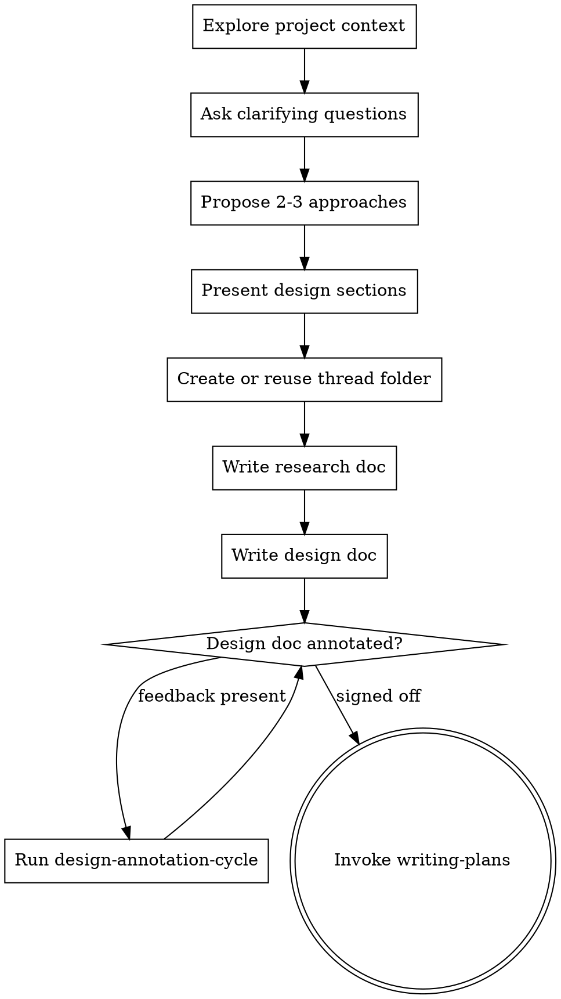

# Brainstorming Ideas Into Designs

## Overview

Help turn ideas into fully formed designs and specs through natural collaborative dialogue.

Start by understanding the current project context, then ask questions one at a time to refine the idea. Once you understand what you're building, write the research doc and design doc, get the design doc annotated and signed off, then hand off to planning.

<HARD-GATE>
Do NOT invoke any implementation skill, write any code, scaffold any project, or take any implementation action until the design doc annotation cycle is complete and the design is signed off.

Exception: you MAY skip this skill and proceed directly to implementation when BOTH of these are true:
1. The user explicitly says to implement now (for example: "do this", "implement now", "just fix it").
2. The work is clear continuation work with an active design/plan or otherwise has no unresolved design choice.

For new work, ambiguous work, or revised design work, this gate still applies in full.
</HARD-GATE>

## Direct-Implementation Fast Path

Use the fast path instead of brainstorming when the request is already execution-ready:
- explicit implementation command from the user (`do this`, `implement now`, `fix it now`)
- active `docs/plans/<slug>/design.md` or `docs/plans/<slug>/plan.md` already exists for the same work
- clear continuation from the immediately preceding session state
- no unresolved product/design choice remains

If any real design ambiguity remains, do NOT use the fast path.

## Anti-Pattern: "This Is Too Simple To Need A Design"

Every project goes through this process. A todo list, a single-function utility, a config change — all of them. "Simple" projects are where unexamined assumptions cause the most wasted work. The design can be short (a few sentences for truly simple projects), but you MUST present it and get approval.

## Checklist

You MUST create a task for each of these items and complete them in order:

1. **Explore project context** — check files, docs, recent commits
2. **Ask clarifying questions** — one at a time, understand purpose/constraints/success criteria
3. **Propose 2-3 approaches** — with trade-offs and your recommendation
4. **Present design** — in sections scaled to their complexity, get user approval after each section
5. **Create or reuse the initiative thread** — use `docs/plans/<slug>/` with `index.md`, `research.md`, and `design.md`
6. **Write research doc** — save to `docs/plans/<slug>/research.md` and update `docs/plans/<slug>/index.md`
7. **Write design doc** — save to `docs/plans/<slug>/design.md` and update `docs/plans/<slug>/index.md`
8. **Run design annotation cycle** — open the design doc in Zed, collect `<<>>` feedback, resolve it with `superpowers:design-annotation-cycle`
9. **Transition to implementation** — invoke `writing-plans`, then continue autonomously into execution

## Process Flow

**The terminal state is invoking writing-plans.** Do NOT invoke frontend-design, mcp-builder, or any other implementation skill. The ONLY skill you invoke after brainstorming is writing-plans.

## The Process

**Understanding the idea:**
- Check out the current project state first (files, docs, recent commits)
- Ask questions one at a time to refine the idea
- Prefer multiple choice questions when possible, but open-ended is fine too
- Only one question per message - if a topic needs more exploration, break it into multiple questions
- Focus on understanding: purpose, constraints, success criteria
- When unknowns that can change design appear, **REQUIRED SUB-SKILL:** use `superpowers:research-before-planning`

**Exploring approaches:**
- Propose 2-3 different approaches with trade-offs
- Present options conversationally with your recommendation and reasoning
- Lead with your recommended option and explain why
- Use research loops in tandem with brainstorming: question -> research update -> decision

**Presenting the design:**
- Once you believe you understand what you're building, present the design
- Scale each section to its complexity: a few sentences if straightforward, up to 200-300 words if nuanced
- Ask after each section whether it looks right so far
- Cover: architecture, components, data flow, error handling, testing
- Be ready to go back and clarify if something doesn't make sense
- After the conversational design is stable, write the research doc and design doc before signoff

## Design Doc Signoff

After saving the first design doc draft:
- Open `docs/plans/<slug>/design.md` in Zed immediately
- Ask the user to annotate the file with inline `<<>>` comments
- **REQUIRED SUB-SKILL:** use `superpowers:design-annotation-cycle`
- Repeat until zero `<<>>` lines remain
- Update `docs/plans/<slug>/index.md` so it reflects the current phase, next action, and `resume_from`
- Only then is the design locked

The design doc, not the implementation plan, is the human signoff artifact.

## After the Design

**Documentation:**
- Create or reuse `docs/plans/<slug>/` in line with `docs/agent-doc-system.md`
- Initialize or update `docs/plans/<slug>/index.md` before writing docs
- Write the validated research doc to `docs/plans/<slug>/research.md`
- Write the validated design doc to `docs/plans/<slug>/design.md`
- Update `docs/plans/<slug>/index.md` after material research or design changes so phase, next action, current docs, and `resume_from` stay accurate
- Use elements-of-style:writing-clearly-and-concisely skill if available
- Commit the docs to git

**Implementation:**
- Invoke the writing-plans skill to create a detailed implementation plan after design signoff
- Planning and execution continue autonomously after design signoff unless a real blocker appears
- Do NOT create a second annotation loop on the plan

## Key Principles

- **One question at a time** - Don't overwhelm with multiple questions
- **Multiple choice preferred** - Easier to answer than open-ended when possible
- **YAGNI (You Aren't Gonna Need It) ruthlessly** - Remove unnecessary features from all designs
- **Explore alternatives** - Always propose 2-3 approaches before settling
- **Research and brainstorming are a loop** - Research answers decision questions; brainstorming uses those answers
- **Incremental validation** - Present design, then get signoff on the design doc before moving on
- **Be flexible** - Go back and clarify when something doesn't make sense
