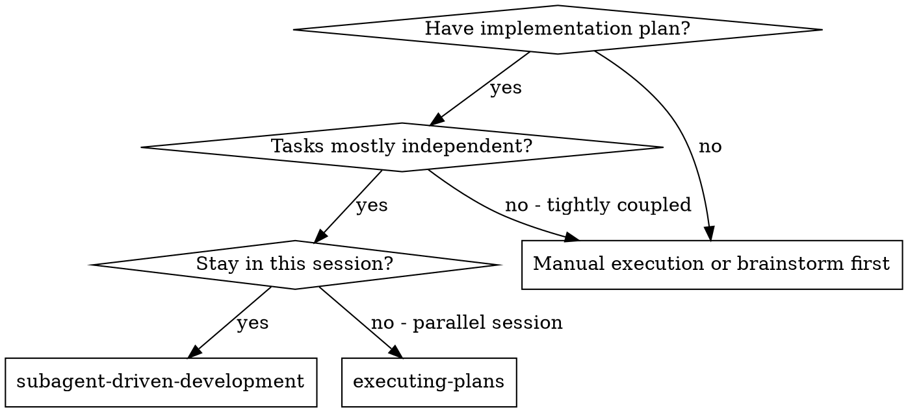

# Subagent-Driven Development

Execute plan by dispatching fresh subagents with two-stage review after each implementation unit: spec compliance review first, then code quality review.

**Core principle:** Use `sprint-orchestrator` for sprint-scoped or other top-level grouped work, then let it delegate grouped parent work to `task-orchestrator`. Use `task-orchestrator` for parent tasks that already contain child subitems. Leaf implementation units still use the same two-stage review loop (spec then quality).

## When to Use



**vs. Executing Plans (parallel session):**
- Same session (no context switch)
- Fresh subagent per task (no context pollution)
- Two-stage review after each task: spec compliance first, then code quality
- Faster iteration (no human-in-loop between tasks)

## The Process

If `>>` notes appear or are discovered while executing tasks:
- Refresh the plan via `superpowers:writing-plans` and/or `superpowers:plan-annotation-cycle`
- Continue execution once the relevant plan section is updated

Sprint-scoped or other top-level grouped work SHOULD dispatch `sprint-orchestrator`. Grouped parent tasks with child subitems SHOULD dispatch `task-orchestrator`, even when child execution is sequential. The controller SHOULD expect synthesized results from these orchestrators instead of micromanaging each lower-level step directly.

```dot
digraph process {
    rankdir=TB;

    subgraph cluster_sprint_task {
        label="Top-Level Grouped Work";
        "Dispatch sprint-orchestrator subagent" [shape=box];
        "sprint-orchestrator preserves grouping or clusters into workstreams" [shape=box];
        "sprint-orchestrator dispatches task-orchestrator subagents" [shape=box];
        "sprint-orchestrator may dispatch lone trivial leaf work directly" [shape=box];
        "sprint-orchestrator synthesizes top-level result" [shape=box];
    }

    subgraph cluster_parent_task {
        label="Parent Task With Child Subitems";
        "Dispatch task-orchestrator subagent" [shape=box];
        "task-orchestrator decides sequential vs parallel child execution" [shape=box];
        "task-orchestrator dispatches implementer/reviewer child subagents" [shape=box];
        "task-orchestrator synthesizes parent result" [shape=box];
    }

    subgraph cluster_leaf_task {
        label="Leaf Implementation Unit";
        "Dispatch implementer subagent (./implementer-prompt.md)" [shape=box];
        "Implementer subagent asks questions?" [shape=diamond];
        "Answer questions, provide context" [shape=box];
        "Implementer subagent implements, tests, commits, self-reviews" [shape=box];
        "Dispatch spec reviewer subagent (./spec-reviewer-prompt.md)" [shape=box];
        "Spec reviewer subagent confirms code matches spec?" [shape=diamond];
        "Implementer subagent fixes spec gaps" [shape=box];
        "Dispatch code quality reviewer subagent (./code-quality-reviewer-prompt.md)" [shape=box];
        "Code quality reviewer subagent approves?" [shape=diamond];
        "Implementer subagent fixes quality issues" [shape=box];
        "Mark task complete in TodoWrite" [shape=box];
    }

    "Read plan, extract all tasks with full text, note context, create TodoWrite" [shape=box];
    "Task is sprint/top-level grouped?" [shape=diamond];
    "Task has child subitems?" [shape=diamond];
    "More tasks remain?" [shape=diamond];
    "Dispatch final code reviewer subagent for entire implementation" [shape=box];
    "Use superpowers:finishing-a-development-branch" [shape=box style=filled fillcolor=lightgreen];

    "Read plan, extract all tasks with full text, note context, create TodoWrite" -> "Task is sprint/top-level grouped?";
    "Task is sprint/top-level grouped?" -> "Dispatch sprint-orchestrator subagent" [label="yes"];
    "Dispatch sprint-orchestrator subagent" -> "sprint-orchestrator preserves grouping or clusters into workstreams";
    "sprint-orchestrator preserves grouping or clusters into workstreams" -> "sprint-orchestrator dispatches task-orchestrator subagents";
    "sprint-orchestrator dispatches task-orchestrator subagents" -> "sprint-orchestrator may dispatch lone trivial leaf work directly";
    "sprint-orchestrator may dispatch lone trivial leaf work directly" -> "sprint-orchestrator synthesizes top-level result";
    "sprint-orchestrator synthesizes top-level result" -> "More tasks remain?";

    "Task is sprint/top-level grouped?" -> "Task has child subitems?" [label="no"];
    "Task has child subitems?" -> "Dispatch task-orchestrator subagent" [label="yes"];
    "Dispatch task-orchestrator subagent" -> "task-orchestrator decides sequential vs parallel child execution";
    "task-orchestrator decides sequential vs parallel child execution" -> "task-orchestrator dispatches implementer/reviewer child subagents";
    "task-orchestrator dispatches implementer/reviewer child subagents" -> "task-orchestrator synthesizes parent result";
    "task-orchestrator synthesizes parent result" -> "More tasks remain?";

    "Task has child subitems?" -> "Dispatch implementer subagent (./implementer-prompt.md)" [label="no"];
    "Dispatch implementer subagent (./implementer-prompt.md)" -> "Implementer subagent asks questions?";
    "Implementer subagent asks questions?" -> "Answer questions, provide context" [label="yes"];
    "Answer questions, provide context" -> "Dispatch implementer subagent (./implementer-prompt.md)";
    "Implementer subagent asks questions?" -> "Implementer subagent implements, tests, commits, self-reviews" [label="no"];
    "Implementer subagent implements, tests, commits, self-reviews" -> "Dispatch spec reviewer subagent (./spec-reviewer-prompt.md)";
    "Dispatch spec reviewer subagent (./spec-reviewer-prompt.md)" -> "Spec reviewer subagent confirms code matches spec?";
    "Spec reviewer subagent confirms code matches spec?" -> "Implementer subagent fixes spec gaps" [label="no"];
    "Implementer subagent fixes spec gaps" -> "Dispatch spec reviewer subagent (./spec-reviewer-prompt.md)" [label="re-review"];
    "Spec reviewer subagent confirms code matches spec?" -> "Dispatch code quality reviewer subagent (./code-quality-reviewer-prompt.md)" [label="yes"];
    "Dispatch code quality reviewer subagent (./code-quality-reviewer-prompt.md)" -> "Code quality reviewer subagent approves?";
    "Code quality reviewer subagent approves?" -> "Implementer subagent fixes quality issues" [label="no"];
    "Implementer subagent fixes quality issues" -> "Dispatch code quality reviewer subagent (./code-quality-reviewer-prompt.md)" [label="re-review"];
    "Code quality reviewer subagent approves?" -> "Mark task complete in TodoWrite" [label="yes"];
    "Mark task complete in TodoWrite" -> "More tasks remain?";
    "More tasks remain?" -> "Task has child subitems?" [label="yes"];
    "More tasks remain?" -> "Dispatch final code reviewer subagent for entire implementation" [label="no"];
    "Dispatch final code reviewer subagent for entire implementation" -> "Use superpowers:finishing-a-development-branch";
}
```



## Prompt Templates

- `./implementer-prompt.md` - Dispatch implementer subagent
- `./spec-reviewer-prompt.md` - Dispatch spec compliance reviewer subagent
- `./code-quality-reviewer-prompt.md` - Dispatch code quality reviewer subagent

## Example Workflow

```
You: I'm using Subagent-Driven Development to execute this plan.

[Read plan file once: docs/plans/feature-plan.md]
[Extract all 5 tasks with full text and context]
[Create TodoWrite with all tasks]

Task 1: Sprint or other top-level grouped work

[Get sprint/workstream text and grouped tasks (already extracted)]
[Dispatch sprint-orchestrator with full sprint text + grouped tasks + context]

sprint-orchestrator:
  - preserves explicit grouping when present
  - clusters into workstreams only if the plan is under-grouped
  - dispatches task-orchestrator for grouped parent work
  - may dispatch a lone trivial leaf task directly when that is the sensible exception
  - returns a synthesized top-level result

Task 2: Parent task with child subitems

[Get parent task text and child subitems (already extracted)]
[Dispatch task-orchestrator with full parent-task text + child subitems + context]

task-orchestrator:
  - determines child task ordering
  - dispatches leaf implementer/reviewer subagents sequentially or in parallel as needed
  - returns a synthesized parent-task result

Task 3: Hook installation script

[Get Task 2 text and context (already extracted)]
[Dispatch implementation subagent with full task text + context]

Implementer: "Before I begin - should the hook be installed at user or system level?"

You: "User level (~/.config/superpowers/hooks/)"

Implementer: "Got it. Implementing now..."
[Later] Implementer:
  - Implemented install-hook command
  - Added tests, 5/5 passing
  - Self-review: Found I missed --force flag, added it
  - Committed

[Dispatch spec compliance reviewer]
Spec reviewer: ✅ Spec compliant - all requirements met, nothing extra

[Get git SHAs, dispatch code quality reviewer]
Code reviewer: Strengths: Good test coverage, clean. Issues: None. Approved.

[Mark Task 1 complete]

Task 2: Recovery modes

[Get Task 2 text and context (already extracted)]
[Dispatch implementation subagent with full task text + context]

Implementer: [No questions, proceeds]
Implementer:
  - Added verify/repair modes
  - 8/8 tests passing
  - Self-review: All good
  - Committed

[Dispatch spec compliance reviewer]
Spec reviewer: ❌ Issues:
  - Missing: Progress reporting (spec says "report every 100 items")
  - Extra: Added --json flag (not requested)

[Implementer fixes issues]
Implementer: Removed --json flag, added progress reporting

[Spec reviewer reviews again]
Spec reviewer: ✅ Spec compliant now

[Dispatch code quality reviewer]
Code reviewer: Strengths: Solid. Issues (Important): Magic number (100)

[Implementer fixes]
Implementer: Extracted PROGRESS_INTERVAL constant

[Code reviewer reviews again]
Code reviewer: ✅ Approved

[Mark Task 2 complete]

...

[After all tasks]
[Dispatch final code-reviewer]
Final reviewer: All requirements met, ready to merge

Done!
```

## Advantages

**vs. Manual execution:**
- Subagents follow TDD naturally
- Fresh context per task (no confusion)
- Parallel-safe (subagents don't interfere)
- Subagent can ask questions (before AND during work)

**vs. Executing Plans:**
- Same session (no handoff)
- Continuous progress (no waiting)
- Review checkpoints automatic

**Efficiency gains:**
- No file reading overhead (controller provides full text)
- Controller curates exactly what context is needed
- Subagent gets complete information upfront
- Questions surfaced before work begins (not after)

**Quality gates:**
- Self-review catches issues before handoff
- Two-stage review: spec compliance, then code quality
- Review loops ensure fixes actually work
- Spec compliance prevents over/under-building
- Code quality ensures implementation is well-built

**Cost:**
- More subagent invocations (implementer + 2 reviewers per task)
- Controller does more prep work (extracting all tasks upfront)
- Review loops add iterations
- But catches issues early (cheaper than debugging later)

## Red Flags

**Never:**
- Start implementation on main/master branch without explicit user consent
- Let subagents create or switch branches (`git checkout`, `git switch`, `git branch`) unless explicitly requested by the user
- Skip reviews (spec compliance OR code quality)
- Proceed with unfixed issues
- Dispatch multiple implementation subagents in parallel from the controller for a single parent task; use `task-orchestrator` to own grouped child work
- Flatten sprint/top-level grouped work directly from the controller when `sprint-orchestrator` should own it
- Make subagent read plan file (provide full text instead)
- Skip scene-setting context (subagent needs to understand where task fits)
- Ignore subagent questions (answer before letting them proceed)
- Accept "close enough" on spec compliance (spec reviewer found issues = not done)
- Skip review loops (reviewer found issues = implementer fixes = review again)
- Let implementer self-review replace actual review (both are needed)
- **Start code quality review before spec compliance is ✅** (wrong order)
- Move to next task while either review has open issues

**If subagent asks questions:**
- Answer clearly and completely
- Provide additional context if needed
- Don't rush them into implementation

**If reviewer finds issues:**
- Implementer (same subagent) fixes them
- Reviewer reviews again
- Repeat until approved
- Don't skip the re-review

**If subagent fails task:**
- Dispatch fix subagent with specific instructions
- Don't try to fix manually (context pollution)

## Branch Discipline

- Subagents must stay on the controller's current branch.
- Controller prompt should include: `Current branch: <branch-name>` and `Do not create/switch branches`.
- Any subagent that changes branch is out-of-spec; stop and return to the intended branch before continuing.

## Integration

**Required workflow skills:**
- **superpowers:using-git-worktrees** - REQUIRED: Set up isolated workspace before starting
- **superpowers:writing-plans** - Creates the plan this skill executes
- **superpowers:requesting-code-review** - Code review template for reviewer subagents
- **superpowers:finishing-a-development-branch** - Complete development after all tasks

**Subagents should use:**
- **superpowers:test-driven-development** - Subagents follow TDD for each task

**Alternative workflow:**
- **superpowers:executing-plans** - Use for parallel session instead of same-session execution
