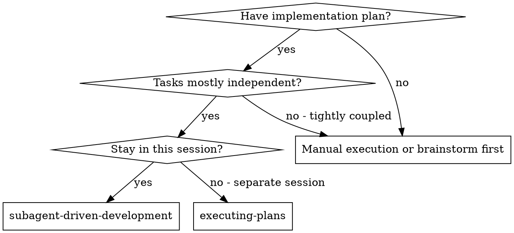

# Subagent-Driven Development

Execute the plan in this session by spawning focused subagents with `Agent`, then running two reviews after each implementation unit: spec compliance first, code quality second.

**Core principle:** The controller owns decomposition, task order, and progress tracking. Subagents own narrow execution units with isolated context.

**Tooling rule:** You MUST use the installed `pi-subagents` tools: `Agent`, `get_subagent_result`, and `steer_subagent`.

**Schema rule:** You MUST call `Agent` with `subagent_type`, `prompt`, and `description`. You MUST NOT write instructions for the legacy `subagent` tool or its old `agent`/`kind`/`label` payload shape.

## When to Use



Use this when:
- the plan already exists
- tasks can be decomposed into narrow execution units
- you want continuous iteration in the current session
- you want review after each task, not only at the end

Use `superpowers:executing-plans` instead when:
- execution should happen in a separate session
- you want batch checkpoints instead of per-task steering
- the plan is large enough that isolating execution context in another session is cleaner

## Agent Types

Default choices:
- `general-purpose` — implementation, fixes, and reviews unless the repo provides a better custom type
- `Explore` — read-only reconnaissance
- `Plan` — read-only design or plan refinement

Project-local custom agent types MAY exist in `.pi/agents/*.md`. Prefer them only when they clearly fit the work better than the built-ins.

## The Process

If `>>` notes appear or are discovered while executing:
- refresh the plan via `superpowers:writing-plans` and/or `superpowers:plan-annotation-cycle`
- resume execution only after the relevant plan section is updated

### 1. Controller prep
- Read the plan once.
- Extract each task's full text and required context.
- Create TodoWrite entries.
- Keep the controller thread focused on status, blockers, synthesized outcomes, and verification results.
- Do NOT make subagents read the plan file unless that is the task under test.

### 2. Decompose grouped work yourself
- Process top-level sprints or other grouped phases sequentially unless the plan explicitly allows top-level parallelism.
- Break grouped parent work into leaf execution units before dispatch.
- Use background `Agent` calls only for truly independent leaf tasks.
- Keep raw child transcripts out of the main thread unless a blocker or review requires quoting them.

### 3. Dispatch the implementer
Use `Agent` for each concrete execution unit.

Foreground example:

```json
{
  "subagent_type": "general-purpose",
  "description": "Implement retry banner",
  "prompt": "Implement Ticket 2.1 from the provided plan excerpt. Current branch: ep/retry-banner. Do not create or switch branches. Follow TDD. Run the required verification commands. Return a concise summary of changes, verification, and any open questions.\n\n[insert task text and context here]"
}
```

Background example for independent work:

```json
{
  "subagent_type": "general-purpose",
  "description": "Implement parser cleanup",
  "prompt": "Implement the provided leaf task. Current branch: ep/parser-cleanup. Do not create or switch branches. Return summary + verification.\n\n[insert task text and context here]",
  "run_in_background": true
}
```

### 4. Handle questions and drift
- If a subagent asks a question or starts drifting, answer with `steer_subagent`.
- Keep steering specific: unblock the exact ambiguity, then tell the agent to continue.
- Do NOT abandon a good subagent run just because clarification was needed.

Example:

```json
{
  "agent_id": "agent_123",
  "message": "Use the user-level install path only. Keep the existing CLI shape. Continue from your current branch state."
}
```

### 5. Collect background results
- Use `get_subagent_result` for background agents.
- Wait when needed; do not guess completion.
- Synthesize the result into the controller thread before moving on.

Example:

```json
{
  "agent_id": "agent_123",
  "wait": true
}
```

### 6. Run the two review loops
After implementation completes:
1. Dispatch a spec-compliance review agent.
2. If it finds issues, send the fixes back to the implementer and re-review.
3. Only after spec compliance is clean, dispatch a code-quality review agent.
4. If it finds issues, send the fixes back to the implementer and re-review.
5. Mark the task done only when both reviews are clean.

Review example:

```json
{
  "subagent_type": "general-purpose",
  "description": "Review retry banner for spec compliance",
  "prompt": "Review the completed Ticket 2.1 implementation for spec compliance only. Do not propose style cleanups unless they violate the spec. Return: pass/fail, exact gaps, and file-path evidence.\n\nRequirements:\n[insert task requirements]\n\nImplementation summary:\n[insert implementer summary]"
}
```

Then:

```json
{
  "subagent_type": "general-purpose",
  "description": "Review retry banner for code quality",
  "prompt": "Review the completed Ticket 2.1 implementation for code quality only. Check correctness evidence, maintainability, simplicity, tests, and docs. Return strengths, issues by severity, and exact file-path evidence.\n\nRequirements:\n[insert task requirements]\n\nImplementation summary:\n[insert implementer summary]"
}
```

### 7. Finish the session
After all tasks are complete and verified:
- use `superpowers:finishing-a-development-branch`

## Example Workflow

```text
You: I'm using Subagent-Driven Development to execute this plan.

[Read plan once]
[Extract task text and context]
[Create TodoWrite]

Task 1: implement retry banner
- Dispatch Agent(general-purpose) with the exact task text
- Agent asks one clarifying question
- Answer via steer_subagent
- Collect final result
- Dispatch spec review Agent
- Implementer fixes one spec gap
- Re-run spec review
- Dispatch code-quality review Agent
- Implementer fixes one maintainability issue
- Re-run code-quality review
- Mark task complete

Task 2: independent parser cleanup
- Dispatch Agent(..., run_in_background=true)
- Continue prepping the next task
- Use get_subagent_result(wait=true) when ready
- Run the same two review loops
```

## Advantages

- Fresh context per task
- Easy steering without losing the run
- Optional background parallelism for independent tasks
- Strong quality gates via explicit spec and quality review loops
- Controller thread stays clean because it stores only synthesized state

## Red Flags

Never:
- write legacy `subagent` payloads
- use project-specific old agent names unless they actually exist in `.pi/agents/`
- ask subagents to create or switch branches unless explicitly requested
- skip spec review
- start code-quality review before spec review is clean
- move to the next task while either review has open issues
- dispatch multiple background implementers against the same files or shared mutable state
- make subagents reread the whole plan when you can provide the exact task excerpt
- ignore subagent questions or drift signals

If a subagent fails:
- dispatch a new focused implementer with the failure context
- do NOT patch manually in the controller unless the user explicitly wants manual execution

## Branch Discipline

- Subagents MUST stay on the controller's current branch.
- Controller prompts SHOULD include: `Current branch: <branch-name>` and `Do not create or switch branches.`
- Any subagent that changes branch is out of spec. Stop and recover before continuing.

## Integration

**Required workflow skills:**
- **superpowers:using-git-worktrees** - REQUIRED: Set up isolated workspace before starting
- **superpowers:writing-plans** - Creates the plan this skill executes
- **superpowers:requesting-code-review** - Review guidance for per-task reviewers
- **superpowers:finishing-a-development-branch** - Complete development after all tasks

**Subagents should use:**
- **superpowers:test-driven-development** - Implementation agents SHOULD follow TDD for each task

**Alternative workflow:**
- **superpowers:executing-plans** - Use for a separate execution session instead of same-session execution
